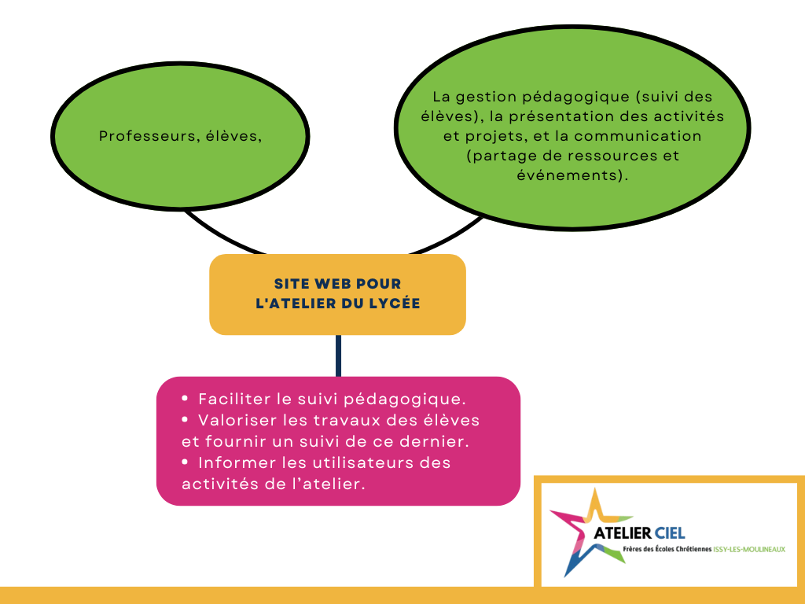

# atelierCIEL

## 1. Introduction
L'objectif de ce projet est de créer un site web pour l'atelier du lycée. Ce site servira à la fois à présenter les activités et réalisations de l'atelier et à fournir aux élèves un espace personnel pour consulter des références et des exercices partagés par les professeurs.

## 2. Objectifs du site web

### 2.1 Objectifs principaux
- **Suivi pédagogique** : Permettre aux professeurs de suivre les élèves et de partager des ressources pédagogiques.
- **Informer** : Présenter les activités, les projets et les événements organisés par l’atelier.
- **Valoriser** : Mettre en avant les réalisations et créations des élèves.

### 2.2 Public Cible
- Professeurs et personnel administratif.
- Élèves du lycée.

## 3. Fonctionnalités requises

### 3.1 Page d’accueil
- Introduction claire de l’atelier avec une photo ou une bannière attrayante.
- Accès rapide aux sections principales (connexion, activités, projets, événements).

### 3.2 Section "Suivi des élèves"
- **Connexion sécurisée** : Fonction "Connexion" permettant aux élèves et professeurs d’accéder à un espace personnel.
- **Interface pour les professeurs** permettant de partager des documents (PDF, liens, Quiz, etc.).
- **Section pour poster des exercices** avec une description et des fichiers associés.
- **Accès pour les élèves** pour consulter et télécharger les ressources.
- **Historique des notes**.

### 3.3 Section "Activités"
- Description des différentes activités proposées par l’atelier.
- Calendrier ou planning des ateliers.

### 3.4 Section "Projets et réalisations"
- Galerie photo/vidéo des travaux réalisés par les élèves.
- Descriptions des projets en cours ou terminés.

### 3.5 Section "Événements"
- Liste des événements passés et à venir.
- Informations pratiques sur les événements (date, lieu, programme).

### 3.6 Section "Contact"
- **Formulaire de contact** (nom, e-mail, message).
- **Coordonnées de l’atelier** (adresse, téléphone).

## 4. Spécifications techniques

### 4.1 Langages et technologies
- **Front-end** : HTML5, CSS, JavaScript.
- **Framework possible** : Bootstrap pour une bonne conception responsive.
- **Back-end** : PHP, Python (Django/Flask), ou Node.js si une base de données est nécessaire.
- **Base de données** : MySQL ou SQLite pour stocker les données (si besoin).

### 4.2 Responsive design
- Le site doit être adapté aux différents appareils : ordinateurs, tablettes, smartphones.

### 4.3 Accessibilité
- Respect des normes d’accessibilité pour garantir l’accès au site à tous les utilisateurs.

## 5. Planning

### 5.1 Étapes du projet
1. **Analyse des besoins** : Discussions avec les professeurs et élèves pour affiner les attentes.
2. **Conception** : Maquettes du site.
3. **Développement** : Codage des différentes pages et fonctionnalités.
4. **Tests** : Vérification du bon fonctionnement sur différents navigateurs et appareils.
5. **Mise en ligne** : Publication et présentation officielle.

### 5.2 Durée estimée
Le projet devrait être réalisé en **7 à 8 mois**, en fonction de nos disponibilité à travailler sur le projet.

## 6. Contraintes et limites
- **Ressources** : Le projet doit être réalisé avec des outils accessibles (open source de préférence).
- **Budget** : Budget limité pour les éventuels frais d’hébergement ou de domaine.
- **Temps** : Travail à réaliser en cours et également en parallèle.

## 7. Livrables
- **Site web fonctionnel** avec toutes les sections demandées.
- **Documentation technique et utilisateur** pour faciliter la maintenance.
- **Rapport final** présentant le projet (idées, développements, difficultés, solutions).
